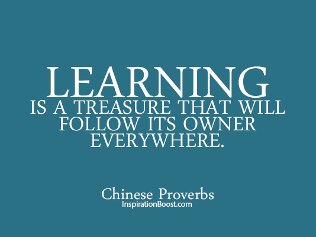

 
### You're here! You made it!
{: .text-center}
 
# WELCOME TO THE WALL!
 {: .text-center}
 
**It's time to contribute to your very first open source project by adding a quick message to welcome everyone who comes after you.**
{: .text-left}
The only rule here is: **please be kind!** The messages that won't make it on the wall are ones that are anything other than welcoming and encouraging. There are a nearly unlimited number of ways to make this space better, so feel free to be creative and think outside the box! If you don't know how to use markdown, here's a [fantastic guide](http://agea.github.io/tutorial.md/). If you're not sure what this wall is about, take a look at [the article](https://towardsdatascience.com/getting-started-with-git-and-github-6fcd0f2d4ac6)!
 
 
**Now get out there and change the world**
 
 
## I can't wait to see what we create together!
{: .text-center}
 
# THE WALL
{: .text-center}

{: .full}
 
 
*Just try new things. Don't be afraid. Step out of your comfort zones and soar, all right?*
 — Michelle Obama
 
 
*Continuous Learning is the only Path worth taking.*
 
 
*The most effective way to do it, is to do it.*
 — Amelia Earhart
 
 
*It is amazing what you can accomplish if you do not care who gets the credit.*
 - Harry S Truman
{: style="color: red"}
 
 

{: .float:right}
 
 
*If you’re not making mistakes, then you’re not making decisions.*
 — Catherine Cook
{: style="color: green"}
 
 
**Welcome to GitHub!!! You're amazing. Congratulations for making it this far!** ~anne
{: style="color:black"}
 
 
*don't forget to breathe*
 
*If you’re feeling helpless, help someone.*
 — Aung San Suu Kyi
{: style="color: orange"; .text-center}
 
*When you notice that you’re having negative thoughts about how all of this is going to pan out,*
*you need to remind yourself that you are not a very good fortune teller.*
 — Donna W. Hill
{: style="color: red"}
 
.jpg){: =150x100 style="float:right; padding:16px"}
 
 
*People will forget what you said, people will forget what you did,*
*but people will never forget how you made them feel.*
 — Maya Angelou
{: style="color: blue"}
 
 
*We can do no great things, only small things with great love.*
  — Mother Teresa
{: style="color: pink"}
 
 
*Nobody cares if you can’t dance well.*
*Just get up and dance.*
*Great dancers are not great because of their technique, they are great because of their passion.*
 — Martha Graham
{: style="color: green"}
 
 
 
*If you obey all the rules, you miss all the fun.*
 — Katharine Hepburn
{: style="color: purple"}
 
 
 
.jpg)
 
 
 
You can do it! Keep at it :) ~ Sara
{: style="color: purple"}
 
 
 
*Failure is not an option*
  - Gene Kranz
 
 
“Anything’s possible if you’ve got enough nerve.” –J.K. Rowling
 
 
*Happy creating! <3*
{: style="color: red; .text-left"}
 
.jpg){: .align-left; =150x100}
 
 
**Congratulations for making it this far. You're a champion!!**
 
 
#### STAY STRONG! KEEP ON MOVING FORWARD!
{: .text-left}
 
 
You're never going to feel ready. You're only going to look back, and realise that you were.
 
 
Every great developer you know got there by solving problems they were unqualified to solve until they actually did it.
 -Patrick McKenzie
 
 
Learning is freedom and freedom is for learning.
 
 

 
 
It doesn't matter what your starting point is. Small increments each day will pay off handsomely in the long run. Keep on keeping on!
 
 
What we learn with pleasure we never forget - Alfred Mercier
 
 
  Never stop trying new things!
 
 
You make your mark though your actions in this world not your intentions. - Ammon
 
 
The cost of inaction is more expensive than making a mistake. - ohhye
 
 
*Do not sit still; start moving now. In the beginning you may not go in the direction you want, but as long as you are moving, you are creating alternatives and possibilities.*
 — Rodolfo Costa
{: .text-center}
 
 
*A man’s life is interesting primarily when he has failed – I well know. For it’s a sign that he tried to surpass himself.*
 — Georges Clemenceau
 
 
Tell me and I forget. Teach me and I remember. Involve me and I learn." - Benjamin Franklin
 
 
This is the start of great things for you!
 
{: .text-center}
 
 Welcome to GitHub! You're amazing. Congratulations for making it this far! 
—Allen  
 
The hardest step is the first, and you have done it. I'm so proud of you!
  
 
If You Commit to Nothing, You’ll Be Distracted By Everything mizu no kokoro...
  
 
The harder you work for something, the greater you’ll feel when you achieve it.
 
 
“Two things are infinite: the universe and human stupidity; and I'm not sure about the universe.”
 
 
"Begin at the beginning," the King said, "and go on till you come to the end: then stop." - Lewis Caroll
 
 
**Welcome to GitHub!!! You're amazing. Congratulations for making it this far!** ~Prakhar 
{: style="color:black"}
 
 
“The saddest aspect of life right now is that science gathers knowledge faster than society gathers wisdom.” ― Isaac Asimov
 
  
“In a gentle way, you can shake the world.” —Mahatma Gandhi
 
 
May Your Heart be Fearless, Mind Fierce and Spirit Free.
 
 
"When nothing seems to help, I go back and look at the stonecutter hammering away at his rock perhaps a hundred times without as much as a crack showing in it. Yet at the hundred and first blow it will split in two, and I know it was not that blow that did it — but all that had gone before."
 
  
"Until I achieve what I want, Giving up is not an option for me"
 
